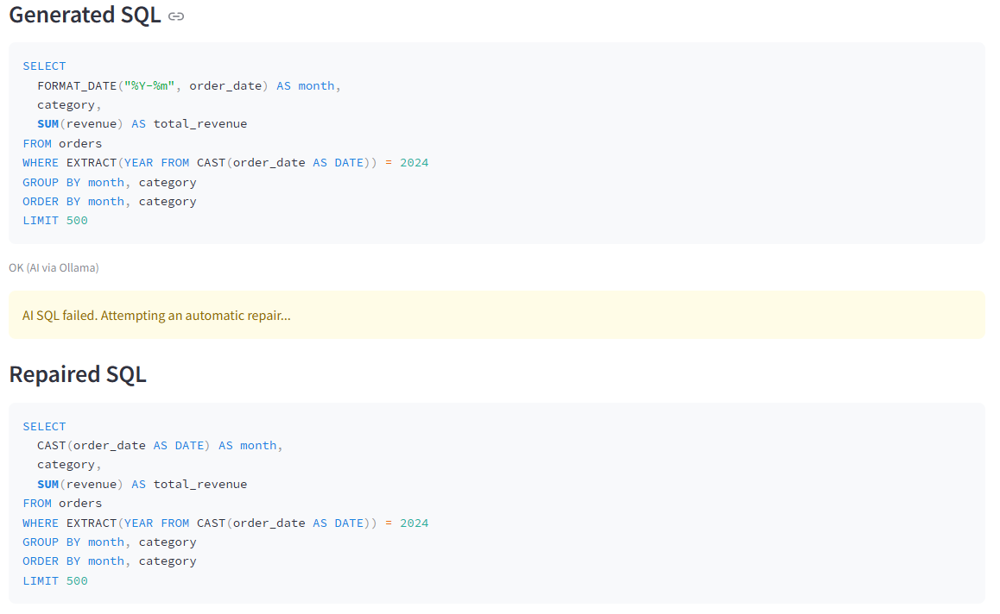
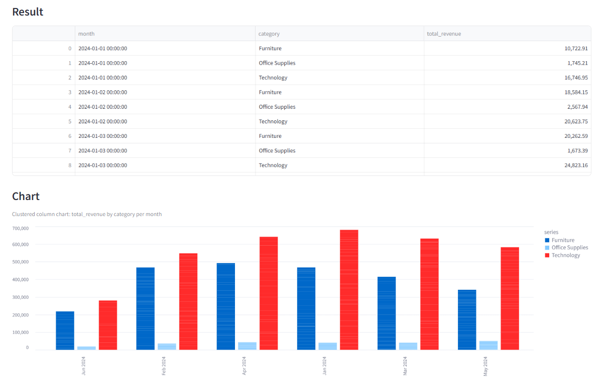

# Ask Your Data (v1) — AI-augmented Analytics Assistant

A lightweight analytics app where users ask business questions in plain English and get:
- generated SQL (transparent)
- results from a database (DuckDB)
- an interactive chart (Altair)

This project is intentionally scoped as a **v1**: small, stable, and focused on the core loop.

---

## What it does

1. User types a question (e.g., “Monthly revenue by category in 2024”)
2. The app generates SQL using either:
   - **Rules (fast):** deterministic patterns for common questions
   - **AI (Ollama):** local LLM for flexible questions
3. **Guardrails** validate SQL (SELECT-only, blocked keywords, no multi-statement)
4. SQL runs against DuckDB
5. If AI SQL fails, the app attempts a **single automatic repair** using the database error + schema
6. The app shows a table and an interactive chart with hover tooltips

---

## Why it matters (design intent)

This demonstrates how to integrate an LLM into analytics without sacrificing:
- determinism (SQL as the contract)
- auditability (SQL visible)
- safety (guardrails)
- usability (repairs + charts)

---

## Tech stack

- Python
- Streamlit (UI)
- DuckDB (analytics database)
- Ollama + LLaMA (local LLM)
- Pandas
- Altair (interactive charts)

---

## Run locally

### 1) Setup
```bash
python -m venv .venv
.venv\Scripts\activate
pip install -r requirements.txt

### 2) Create the sample database
```bash
python data\make_data.py

### 3) Run the app
```bash
streamlit run app.py

## Screenshots

### Natural language → SQL


### Automatic SQL repair


### Results + interactive chart



